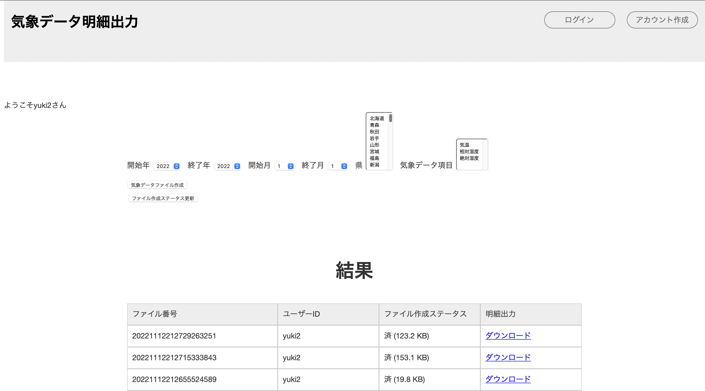
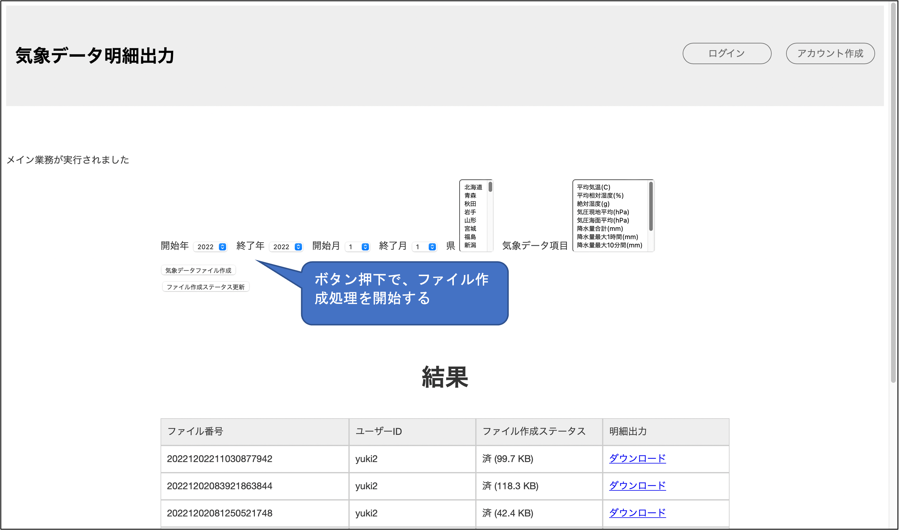
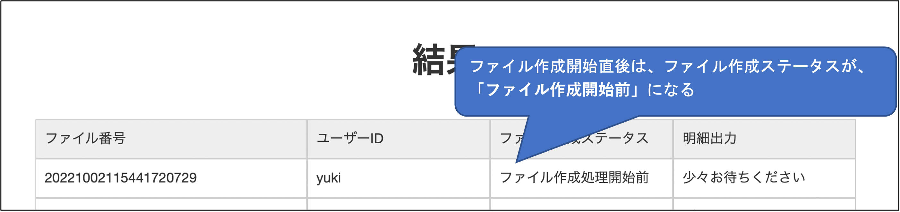
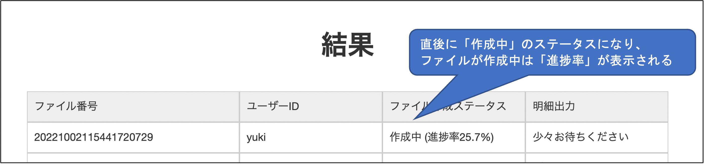
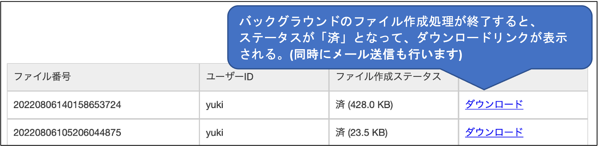
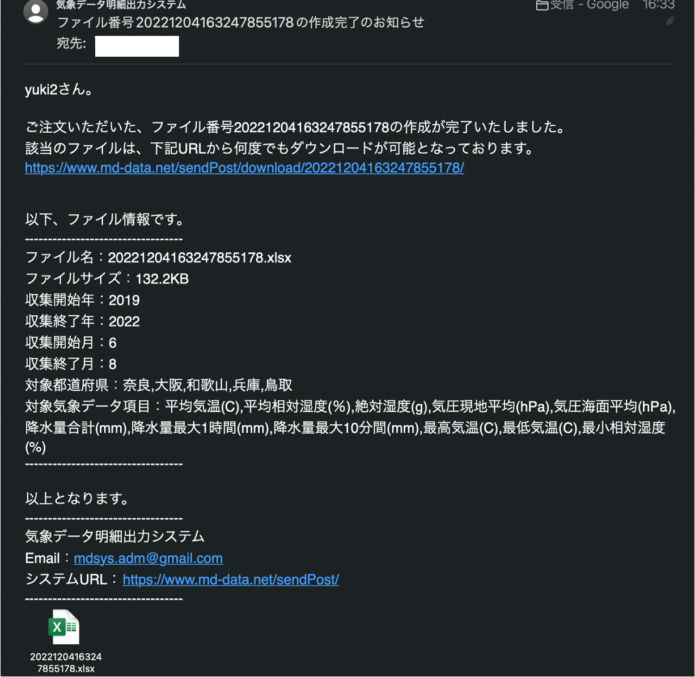
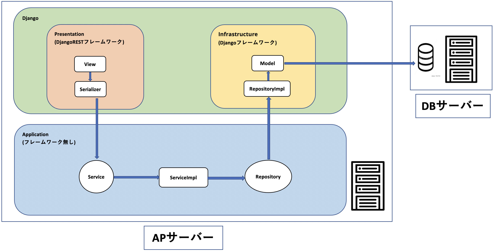
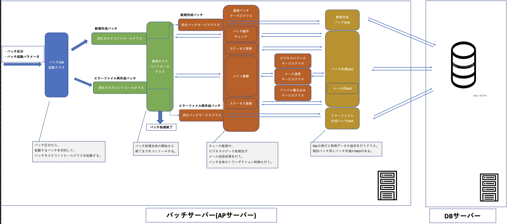

# 気象データ明細出力_サーバーサイドAPI

## システム概要
http://www.md-data.net/sendPost  

<br>
本システムは、画面で指定した年・月・地域の気象データを収集し、  
エクセルファイルとしてダウンロードできるシステムです。  
<br>
収集したデータに対して、ユーザーがエクセル上でグラフや解析を行い、  
研究等に役立てていただくことが本システムの目的です。  

## システム開発の経緯
#### システム開発を始めたきっかけ
当時会社の業務で、システム基盤構築のチームで業務を行なっておりました。  
アーキテクチャを専門としている上司が、毎回夕会で議論されている基盤設計の話を聞いて、  
自分でも基盤を設計してみたいと感じるようになりました。  
そして、以前から自宅に物理サーバーを設置することに憧れていまして、掛け合わせて  
自作のシステムを設計して、設計・開発したシステムを自宅の物理マシン上に乗せて運用したいと感じ、  
システムの開発に至りました。
#### 気象データ明細出力システムを開発したきっかけ
気象データ収集部分のロジックとして、学生の頃に卒業研究で作成した既存のものがありました。  
そのプログラムに対して、大学の教授から大学を卒業する際に、  
プログラムを研究室に残して欲しいと言われたことがきっかけで、  
気象データをエクセルで簡単に入手できるツールがあれば、すぐに解析等に使用できて便利にだと考え、開発に至りました。

## 機能概要
気象データファイルの作成指示から、ファイルダウンロードまでの機能の一連の流れを紹介します。  

<br>
↓
<br>

<br>
↓
<br>

<br>
↓
<br>

<br>
↓(出力されるエクセルファイルのイメージ)
<br>

<br>
↓(ファイル作成完了時にユーザーに自動送信されるメールイメージ)
<br>


## 使用技術
#### フロントエンド
・なし(本レポジトリのシステムは画面を持たないため)  
#### バックエンド
・Python3：個人開発のため気軽さ重視でインタプリタ言語を選定し、  
その中で開発PCに既存の環境が整っていることからPython3を選定  
・Django：FlaskとDjangoを検討し、スキーマにコマンドでテーブル定義を展開できる便利さからDjangoを選定  
#### DB
・MySQL：OracleとMySQLを検討し、導入の簡単さでMeSQLを選定  
#### インフラ
・Ubuntu20.04.3LTS：個人利用向けであること、自宅にUbuntu関連の書籍が存在したことから選定  

## オンラインアーキテクチャ

<br>

## バッチアーキテクチャ

<br>

## パッケージ構成(自動生成ファイルは省略)

```bash
$ tree
.
├── README.md
│
├── application #オンラインビジネスロジック及び永続化レポジトリインターフェースを管理
│   ├── repository #永続化レポジトリインターフェース
│   │   ├── account #認証系永続化レポジトリインターフェース
│   │   │   └── account_repository.py
│   │   ├── mdData #ビジネス系永続化レポジトリインターフェース
│   │   │   ├── errorRequest_repository.py
│   │   │   ├── fileDownload_repository.py
│   │   │   ├── mainBusiness_repository.py
│   │   │   └── userInputItem_repository.py
│   │   └── util #汎用系永続化レポジトリインターフェース
│   │       ├── generalCode_repository.py
│   │       └── saiban_repository.py
│   └── service #オンラインビジネスロジック
│       ├── account #認証系ロジック
│       │   ├── accountService.py
│       │   └── impl
│       │       └── accountServiceImpl.py
│       ├── dto #ServiceDto
│       │   └── mainBusinessServiceDto.py
│       ├── enum #起動バッチ区分の列挙型を管理
│       │   └── exeBatchType.py
│       └── mdData #ビジネスロジック
│           ├── Impl
│           │   ├── errorRequestServiceImpl.py
│           │   ├── fileDownloadServiceImpl.py
│           │   ├── mainBusinessServiceImpl.py
│           │   └── userInputItemServiceImpl.py
│           ├── errorRequestService.py
│           ├── fileDownloadService.py
│           ├── mainBusinessService.py
│           └── userInputItemService.py
│
├── cip_key.txt #暗号復号化キー管理ファイル(実際のキーはGit管理対象外)
│
├── commonUtils #システム共通部品
│   └── cryptUtils #暗号復号化部品
│       ├── decrypt.py
│       └── encrypt.py
│
├── error_log.txt #デバッグトレース内容出力用ファイル
│
├── mainJobBatch #随時バッチ
│   └── taskManage
│       ├── dao #Dao層
│       │   ├── daoImple
│       │   │   ├── errorFileCreateDaoImple.py
│       │   │   ├── mailSendDaoImple.py
│       │   │   ├── mdScrapingDaoImple.py
│       │   │   └── newFileCreateDaoImple.py
│       │   ├── errorFileCreateDao.py
│       │   ├── mailSendDao.py
│       │   ├── mdScrapingDao.py
│       │   └── newFileCreateDao.py
│       ├── exception #エラーハンドリングクラス
│       │   ├── exceptionUtils.py
│       │   └── mdException.py
│       ├── job #バッチ起動クラス
│       │   └── jobExecute.py
│       ├── service #バッチ個別サービス実装
│       │   └── Impl
│       │       ├── errorFileCreateTaskServiceImpl.py
│       │       └── newFileCreateTaskServiceImpl.py
│       ├── serviceBase #バッチ共通基底サービス
│       │   ├── Impl
│       │   │   ├── mdScrapingLogicServiceImpl.py
│       │   │   ├── mdScrapingMailServiceImpl.py
│       │   │   ├── mdScrapingTaskServiceImpl.py
│       │   │   └── mdScrapingXlWriteServiceImpl.py
│       │   ├── mdScrapingLogicService.py
│       │   ├── mdScrapingMailService.py
│       │   ├── mdScrapingTaskService.py
│       │   └── mdScrapingXlWriteService.py
│       └── task #タスクコントローラー
│           ├── base
│           │   └── mdScrapingTask.py
│           ├── errorFileCreateTask.py
│           └── newFileCreateTask.py
│
├── manage.py #オンラインシステムメインプロセス起動
│
├── media #随時バッチで作成したファイルの格納場所
│   └── file
│
├── meteorologicalDataScrapingApp #オンライン・バッチそれぞれの設定ファイルを管理
│   ├── asgi.py
│   ├── job_config.py
│   ├── settings.py
│   ├── urls.py
│   └── wsgi.py
│
├── presentation #ルーティング及びJSONデータのIn/Out処理を行う
│   ├── apps.py
│   ├── enum #enum型定義
│   │   └── resStatusCode.py
│   ├── serializer #認証系とビジネス系それぞれのシリアライズ
│   │   ├── account
│   │   │   └── account.py
│   │   └── mdData
│   │       ├── errorRequest.py
│   │       ├── fileDownload.py
│   │       ├── mainBusiness.py
│   │       └── userInputItem.py
│   ├── url #ルーティング設定
│   │   ├── account.py
│   │   └── mdData.py
│   └── view #JSONデータのIn/Out、View単位のトランザクション管理等を行う
│       ├── account.py
│       └── mdData.py
│
├── requirements.txt #プロジェクトで使用しているライブラリのバージョン管理ファイル
│
├── scrapingSystem #スキーマ管理や永続化処理、オフラインバッチコマンドの管理等を行う
│   ├── admin.py
│   ├── apps.py
│   ├── management #オフラインバッチ管理フォルダ
│   │   └── commands
│   │       └── masterSetting.py
│   ├── migrations #マイグレーション管理フォルダ
│   ├── models.py #スキーマテーブル定義ソース
│   └── repositoryImple #認証系、ビジネス系、汎用系それぞれのレポジトリ実装
│       ├── account
│       │   └── account_repository.py
│       ├── mdData
│       │   ├── errorRequest_repository.py
│       │   ├── fileDownload_repository.py
│       │   ├── mainBusiness_repository.py
│       │   └── userInputItem_repository.py
│       └── util
│           ├── generalCode_repository.py
│           └── saiban_repository.py
│
├── static
│
└── staticfiles
```
 
## システムURL
http://www.md-data.net/sendPost  
(上記は本システムのフロントシステムURLで、サーバーサイドAPIにはフロントシステムのサーバー内でアクセスします) 


## 設計書類の案内
・システムの処理概要  
・オンライン, バッチそれぞれのアーキテクチャ  
・ER図  
・トランザクジョン管理方式  
・インフラ, ネットワーク構成  

上記の詳細情報及びその他本システムの情報については、  
**気象データ明細出力システム_システム設計ドキュメントレポジトリ**を参照してください。
