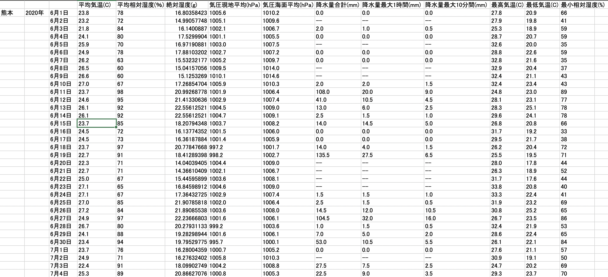

# 気象データ明細出力_サーバーサイドAPI

## システム概要
https://www.md-data.net/sendPost  

<br>
本システムは、画面で指定した年・月・地域の気象データを収集し、  
エクセルファイルとしてダウンロードできるシステムです。  
<br>
ユーザーがエクセル上でグラフや解析を行い、  
卒業論文などに役立てていただくことが本システムの目的です。  

## 本システムの開発の目的
任意の期間、場所の気象データをシステムで収集し、ファイルとして出力します。
本システムから取得できる情報は、研究等の様々な用途に使用することができます。  

本システムを実現するにあたって、気象データの収集は、  
収集期間によっては莫大な時間がかかってしまうため、  
画面上でユーザーにデータを渡すことは難しいという課題があります。  

そこで、気象データ収集スクリプトをバッチ処理としてバックグラウンドで動かし、  
・即座にレスポンスを返却して、ユーザーを画面上で待たせない  
・並列処理を可能にし、時間のかかる大量データのファイルを複数同時に作成可能  
・ファイル作成完了と同時にメールで通知(メールからファイルダウンロード可能)  
バッチ処理で上記の要件を満たすことで、システム化の際の課題を解消しました。  

## 機能概要
気象データファイルの作成指示から、ファイルダウンロードまでの機能の一連の流れを紹介します。  

<br>
↓
<br>

<br>
↓
<br>

<br>
↓
<br>

<br>
↓(出力されるエクセルファイルのイメージ)
<br>

<br>
↓(ファイル作成完了時にユーザーに自動送信されるメールイメージ)
<br>


## 使用技術
#### サーバーサイドAPI
・Python3：学生時代に作成した気象データ収集スクリプトがPython3であったため、システム構築の際にもPython3を選定  
・Django：FlaskとDjangoを検討し、スキーマにコマンドでテーブル定義を展開できる点と、ORマッパーを使用できる点からDjangoを選定  
#### DB
・MySQL：MySQLの環境構築に知見があったため、MySQLを選定  
#### インフラ
・Ubuntu20.04.3LTS：個人利用向けであること、自宅にUbuntu関連の書籍が存在したことから選定  

## オンラインアーキテクチャ

<br>
通常DjangoアーキテクチャはMVTという、Viewの部分に業務ロジックとORマッピングを記述する構成になっています。  
しかしこれでは、システムの拡張を続けることで、Viewが太ってしまうことになります。  
そのためApplication層とInfrastructure層を拡張して、ViewはデータのIn/Outに集中をして、業務ロジックをApplication層に、  
ORマッピング処理をInfrastructure層に移すことで保守性と可読性を向上させました。

## バッチアーキテクチャ

<br>
オンライン処理で貯めたキューを並列(最大3多重)に処理していくバッチ基盤です。バッチでは、気象データファイルの作成やメール送信処理等を行います。  
アーキテクチャの構成は、  
<br>
①バッチを起動する層 (Job層)  
②並列処理の多重度の制御 (Controller層)  
③業務ロジックやトランザクション管理等 (Service層)  
④SQLの発行やDB接続等 (Dao層)  
<br>
上記の4つの層で構成しています。  
バッチではフレームワークは使用せず、Pythonのみで独自に構築をしています。  

## ER図

<br>
マスタ：7テーブル  
トラン：8テーブル  

## トランザクション管理構成図
オンラインの場合はフレームワークで自動で行なっていますが、  
バッチ処理の場合は、下記のシーケンス図のように独自の方式で行なっています。  

<br>

<br>
キュースタックを処理する部分が、「loop」という記述がある黒い枠の部分です。  
キュースタック処理内で異常が発生した場合は、対象のキューを異常終了ステータスにupdateをして、後続のキューの処理を継続します。  
キュースタックを処理するloopに入る前に異常が発生すると、異常が発生したバッチThread自体を終了します。  

## インフラ構成図	

<br>
本システムは、画面側のシステムとデータ処理側のAPIシステムで、完全にシステムが分離している構成になっています。  
Webブラウザ画面側のシステムをクラウド、サーバーサイドAPIをオンプレミスで運用をしています。  
<br>
オンプレミス環境については、外部との疎通に「VPNサーバ」を利用しています。  
(集合住宅のため、自宅のルーターにはパブリックIPアドレスがありません。  
そこで、VPNサーバーを借りてパブリックIPを付与することで、外部との疎通を実現しています。)  

## システム開発時に重視した点
#### フロントエンドとバックエンドの、システム分離
画面表示処理と、業務ロジック等のデータ処理を、別々のサーバーに完全分離しました。  
一つのシステムを、画面表示からDBのIn/Outまでを単一の環境で構築すると、IOS等の別のプラットフォームを拡張しようとした際に、  
別途RESTのゲートウェイを作成する必要が出てきてしまうため、画面表示処理を別のシステムとして切り出し、  
サーバーサイド側は画面を持たない完全なAPIとして扱うようにしました。  
#### アーキに時間をかける
ロジック開発に集中をして今後気軽に機能を拡張できるようにするため、「アーキテクチャ」と「開発」でフェーズを完全に分離しました。  
アーキテクチャが決まるまで開発を一切行わず、紙のノート一冊分を使用しアーキテクチャを検討しました。  
これにより業務開発に集中することができ、1年以上経過した今でもアーキテクチャを一切変更せずに機能の拡張を続けることができました。  

## システム開発時に苦労した点
#### オンプレミスサーバーのネットワークエラー
オンプレミス環境を長時間運用を続けていると、  

<br>
上記のようなエラーが発生し、サーバーのネットワークがダウンしてしまうことが多々発生しておりました。  
このエラーが発生すると、手動でサーバーを再起動することでしか対処することができず、運用面で非常に困っていました。  
現在も根本の解決方法はわからないままです。ただ、まずはサーバーを止めたくないという思いから、応急処置方法を検討しました。  
そこで、Linuxのcronで1日ごとにサーバーを自動で再起動をさせる方法を考えました。  
普段手動で打ち込んでいたサーバー再起動用のコマンド群をバッチファイルに起こし、1日ごとの周期でバッチファイルをキックして  
サーバーを再起動させることで、サーバーのダウンを回避することができました。  
↓サーバー再起動用バッチファイル(一部抜粋)  

<br>

## パッケージ構成(自動生成ファイルは省略)

```bash
$ tree
.
├── README.md
│
├── application #オンラインビジネスロジック及び永続化レポジトリインターフェースを管理
│   ├── repository #永続化レポジトリインターフェース
│   │   ├── account #認証系永続化レポジトリインターフェース
│   │   │   └── account_repository.py
│   │   ├── mdData #ビジネス系永続化レポジトリインターフェース
│   │   │   ├── errorRequest_repository.py
│   │   │   ├── fileDownload_repository.py
│   │   │   ├── mainBusiness_repository.py
│   │   │   └── userInputItem_repository.py
│   │   └── util #汎用系永続化レポジトリインターフェース
│   │       ├── generalCode_repository.py
│   │       └── saiban_repository.py
│   └── service #オンラインビジネスロジック
│       ├── account #認証系ロジック
│       │   ├── accountService.py
│       │   └── impl
│       │       └── accountServiceImpl.py
│       ├── dto #ServiceDto
│       │   └── mainBusinessServiceDto.py
│       ├── enum #起動バッチ区分の列挙型を管理
│       │   └── exeBatchType.py
│       └── mdData #ビジネスロジック
│           ├── Impl
│           │   ├── errorRequestServiceImpl.py
│           │   ├── fileDownloadServiceImpl.py
│           │   ├── mainBusinessServiceImpl.py
│           │   └── userInputItemServiceImpl.py
│           ├── errorRequestService.py
│           ├── fileDownloadService.py
│           ├── mainBusinessService.py
│           └── userInputItemService.py
│
├── cip_key.txt #暗号復号化キー管理ファイル(実際のキーはGit管理対象外)
│
├── commonUtils #システム共通部品
│   └── cryptUtils #暗号復号化部品
│       ├── decrypt.py
│       └── encrypt.py
│
├── error_log.txt #デバッグトレース内容出力用ファイル
│
├── mainJobBatch #随時バッチ
│   └── taskManage
│       ├── dao #Dao層
│       │   ├── daoImple
│       │   │   ├── errorFileCreateDaoImple.py
│       │   │   ├── mailSendDaoImple.py
│       │   │   ├── mdScrapingDaoImple.py
│       │   │   └── newFileCreateDaoImple.py
│       │   ├── errorFileCreateDao.py
│       │   ├── mailSendDao.py
│       │   ├── mdScrapingDao.py
│       │   └── newFileCreateDao.py
│       ├── exception #エラーハンドリングクラス
│       │   ├── exceptionUtils.py
│       │   └── mdException.py
│       ├── job #バッチ起動クラス
│       │   └── jobExecute.py
│       ├── service #バッチ個別サービス実装
│       │   └── Impl
│       │       ├── errorFileCreateTaskServiceImpl.py
│       │       └── newFileCreateTaskServiceImpl.py
│       ├── serviceBase #バッチ共通基底サービス
│       │   ├── Impl
│       │   │   ├── mdScrapingLogicServiceImpl.py
│       │   │   ├── mdScrapingMailServiceImpl.py
│       │   │   ├── mdScrapingTaskServiceImpl.py
│       │   │   └── mdScrapingXlWriteServiceImpl.py
│       │   ├── mdScrapingLogicService.py
│       │   ├── mdScrapingMailService.py
│       │   ├── mdScrapingTaskService.py
│       │   └── mdScrapingXlWriteService.py
│       └── task #タスクコントローラー
│           ├── base
│           │   └── mdScrapingTask.py
│           ├── errorFileCreateTask.py
│           └── newFileCreateTask.py
│
├── manage.py #オンラインシステムメインプロセス起動
│
├── media #随時バッチで作成したファイルの格納場所
│   └── file
│
├── meteorologicalDataScrapingApp #オンライン・バッチそれぞれの設定ファイルを管理
│   ├── asgi.py
│   ├── job_config.py
│   ├── settings.py
│   ├── urls.py
│   └── wsgi.py
│
├── presentation #ルーティング及びJSONデータのIn/Out処理を行う
│   ├── apps.py
│   ├── enum #enum型定義
│   │   └── resStatusCode.py
│   ├── serializer #認証系とビジネス系それぞれのシリアライズ
│   │   ├── account
│   │   │   └── account.py
│   │   └── mdData
│   │       ├── errorRequest.py
│   │       ├── fileDownload.py
│   │       ├── mainBusiness.py
│   │       └── userInputItem.py
│   ├── url #ルーティング設定
│   │   ├── account.py
│   │   └── mdData.py
│   └── view #JSONデータのIn/Out、View単位のトランザクション管理等を行う
│       ├── account.py
│       └── mdData.py
│
├── requirements.txt #プロジェクトで使用しているライブラリのバージョン管理ファイル
│
├── scrapingSystem #スキーマ管理や永続化処理、オフラインバッチコマンドの管理等を行う
│   ├── admin.py
│   ├── apps.py
│   ├── management #オフラインバッチ管理フォルダ
│   │   └── commands
│   │       └── masterSetting.py
│   ├── migrations #マイグレーション管理フォルダ
│   ├── models.py #スキーマテーブル定義ソース
│   └── repositoryImple #認証系、ビジネス系、汎用系それぞれのレポジトリ実装
│       ├── account
│       │   └── account_repository.py
│       ├── mdData
│       │   ├── errorRequest_repository.py
│       │   ├── fileDownload_repository.py
│       │   ├── mainBusiness_repository.py
│       │   └── userInputItem_repository.py
│       └── util
│           ├── generalCode_repository.py
│           └── saiban_repository.py
│
├── static
│
└── staticfiles
```

## システム操作手順
本システムの画面を立ち上げて直後の状態では、

<br>
上記のように、セレクトボックスの中身がない状態で、ボタン等の操作ができないようになっております。  
本システムは、ユーザーが「アカウント作成」と「ログイン」を実施して、初めて画面を操作できるという仕掛けになっております。  
<br>
①  

<br>
まず、本システムのヘッダ部に配置されている「アカウント作成」のボタンを押下します。  

<br>
画面上の赤字部分の制約や説明に沿って、アカウント作成に必要な情報を入力します。  
<br>
②		  

<br>
次に、本システムのヘッダ部に配置されている「ログイン」のボタンを押下します。  

<br>
アカウント作成時に入力した「メールアドレス」と「パスワード」を入力します。  
上記の、①と②の手順を踏むことで、本システムを利用できるようになります。    


## システムURL
https://www.md-data.net/sendPost  
(上記は本システムのフロントシステムURLで、サーバーサイドAPIにはフロントシステムのサーバー内でアクセスします) 


## 設計書類の案内
・システムの処理概要  
・オンライン, バッチそれぞれのアーキテクチャ  
・ER図  
・トランザクジョン管理方式  
・インフラ, ネットワーク構成  

上記の詳細情報及びその他本システムの情報については、  
**気象データ明細出力システム_システム設計ドキュメントレポジトリ**を参照してください。
