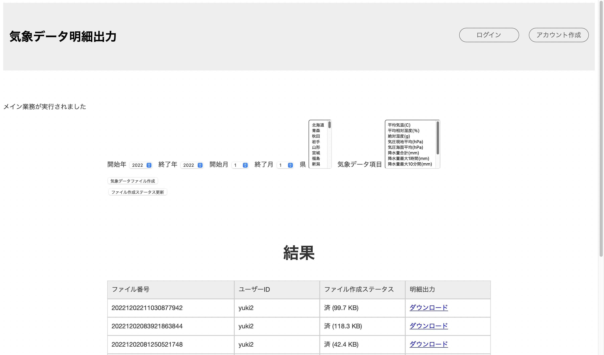
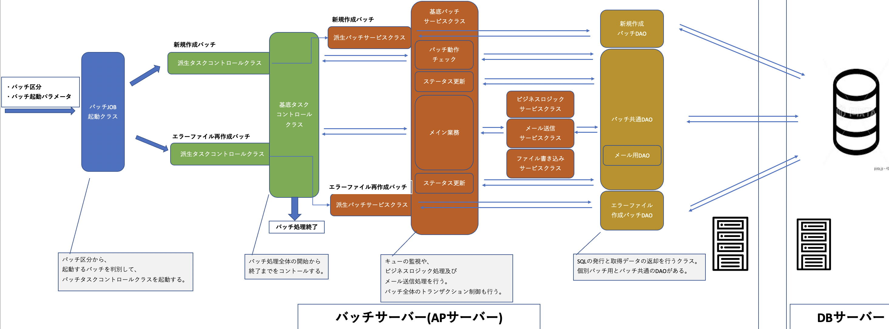

# 気象データ明細出力_サーバーサイドAPI

## システム概要
https://www.md-data.net/sendPost  

<br>
本システムは、画面で指定した年・月・地域の気象データを収集し、  
エクセルファイルとしてダウンロードできるシステムです。  
<br>
収集したデータに対して、ユーザーがエクセル上でグラフや解析を行い、  
研究などに役立てていただくことが本システムの目的です。  

## システム開発の経緯
#### システム開発を始めたきっかけ
当時、業務でシステム基盤構築のチームで業務を行なっておりました。  
アーキテクチャを専門としている上司が、毎回夕会で議論されている基盤設計の話を聞いて、  
自分でも基盤を設計してみたいと考えました。  
そして、以前から自宅に物理サーバーを設置することに憧れていたこともあり  
自作のシステムを設計して、設計・開発したシステムを自宅の物理マシン上に乗せて運用したいと感じ、  
システムの開発に至りました。
#### 気象データ明細出力システムを開発したきっかけ
気象データ収集部分のロジックとして、学生の頃に卒業研究で作成した既存のものがありました。  
当時の学生自体、そのロジックを作った理由として、簡単に色々な地域の気象データを取得して、  
大学の卒業研究を円滑に進めたい。という理由でした。  
上記から、このロジックをシステム化すれば、私と同じように気象データを、様々な期間様々な地域で  
簡単に取得できたらいいなと考えている人の助けになると考え、本システムの開発に至りました。  

## 機能概要
気象データファイルの作成指示から、ファイルダウンロードまでの機能の一連の流れを紹介します。  

<br>
↓
<br>

<br>
↓
<br>

<br>
↓
<br>

<br>
↓(出力されるエクセルファイルのイメージ)
<br>

<br>
↓(ファイル作成完了時にユーザーに自動送信されるメールイメージ)
<br>


## 使用技術
#### サーバーサイドAPI
・Python3：個人開発のため気軽さ重視でインタプリタ言語を選定し、  
その中で唯一知識がある言語がPython3であったため選定しました。    
・Django：FlaskとDjangoを検討し、スキーマにコマンドでテーブル定義を展開できる便利さからDjangoを選定  
#### DB
・MySQL：OracleとMySQLを検討し、導入の容易さでMeSQLを選定  
#### インフラ
・Ubuntu20.04.3LTS：個人利用向けであること、自宅にUbuntu関連の書籍が存在したことから選定  

## オンラインアーキテクチャ

<br>
通常DjangoアーキテクチャはMVTという、Viewの部分にビジネスロジックを記述する構成になっています。  
これでは、ViewがデータのIn/Outと業務ロジックの両方を兼任することになり、Viewが太ってしまうことになります。  
そのためApplication層を拡張して、ViewはデータのIn/Outに集中をして、ビジネスロジックをApplication層に  
移すことで保守性と可読性を向上させました。

## バッチアーキテクチャ

<br>
オンライン処理で貯めたキューを並列に処理していくバッチ基盤です。バッチでは、気象データファイルの作成やメール送信処理等を行います。  
アーキテクチャの構成は、  
①バッチを起動する層  
②バッチのThread全体を制御する層  
③業務ロジックやトランザクション管理等(Service層)  
④Dao層  
上記の4つの層にそれぞれ役割を分担させる構成になっています。  
バッチではフレームワークは使用せず、Pythonのみで構築をしています。  

## ER図

<br>
マスタ：7テーブル  
トラン：8テーブル  

## トランザクション管理構成図
オンラインの場合はフレームワークで自動で行なっていますが、  
バッチ処理の場合は、下記のシーケンス図のように手動で行なっています。  

<br>

<br>
キューを順番に取得して処理をする部分が、「loop」という記述がある黒い枠の部分です。  
キューに対して処理をするloopに入る前に以上が発生すると、異常が発生したThreadを終了します。  
loop内で異常が発生した場合は、対象のキューを異常終了ステータスにupdateをして、後続のキューの処理を継続します。  

## インフラ構成図	

<br>
本システムは、画面側のシステムとデータ処理側のシステムで、完全にシステムが分離している構成になっています。  
(IOSやAndroidなど、様々なフロントシステムを拡張できるようにするためです)  
Webブラウザ画面側のシステムをクラウド、サーバーサイドAPIをオンプレミスで運用をしています。  

## システム開発時に重視した点
#### フロントエンドとバックエンドの、システム分離
Webブラウザ画面表示処理と、サーバーサイドのデータ処理を同じサーバー上で実施することを避けました。  
同じサーバー上で行うと、IOS等の別のプラットフォームを拡張しようとした際に、  
別途RESTのゲートウェイを作成する必要が出てきてしまうため、画面表示処理を別のシステムとして切り出し、  
サーバーサイド側は画面を持たない完全なAPIとして扱うようにしました。  
#### アーキテクチャに時間をかける
業務ロジック開発に集中をして今後気軽に機能を拡張できるようにするため、アーキテクチャと開発でフェーズを完全に分離しました。  
アーキテクチャが決まるまで開発を一切行わず、紙のノート一冊分を使用しアーキテクチャを検討しました。  
これにより業務開発に集中することができ、1年以上経過した今でもアーキテクチャを一切変更せずに機能の拡張を続けることができました。  

## システム開発時に苦労した点
#### バッチ側のトランザクション管理
手動で管理を行なっているバッチ側のトランザクション管理が、データの整合性が取れずに苦労しました。  
特に、バッチを並列で多重起動した際には、数分後には必ずバグが生じるという状態が続きました。  
MySQLコネクタにトランザクションの終了機能は存在しても開始機能が存在しなかったため、明示的なトランザクションの  
開始をしていなかったことが原因でした。  
SQLで直接トランザクションの開始クエリを投げて明示的に開始をすることで、解決をすることができました。  
#### サーバーサイド側のオンプレミスサーバーのVPN接続
開発者の私は集合住宅に住んでいるため、自宅のルーターにはパブリックIPアドレスがありません。
そこで、VPNサーバーを借りてパブリックIPを付与することで疎通をすることができました。  
しかし、VPN接続が2日ほどでダウンし、2日に1回は手で再起動をしないとシステムが動かないという状態でした。  
プロパイダに問い合わせをしても解決をせずに悩んでいた際に、  
Linuxのcronで一定間隔でrouteコマンドを打ち続けるという方法を思いつきました。  
1分間隔でrouteコマンドを打ち続けることで、何ヶ月間運用を続けてもVPN接続が途切れず、サーバーがダウンすることは無くなりました。  

## システムの不足点および今後の展望
#### 作成ファイルの管理場所を別のストレージに切り出す
本システムで作成するエクセルファイルを管理している場所は、現在はオンプレミスAPサーバーのファイルシステムです。  
懸念されることは、作成ファイルが増えてストレージが圧迫されると、サーバーがダウンして起動できなくなる危険性があることです。  
APサーバー上で可変的にストレージを使用するものは、システムで作成するエクセルファイルのみのため、  
システムで作成したファイルを別のホストマシンで管理をしてFTP等でやり取りをするようにすることで、  
APサーバーの使用ストレージを安定させたいと考えております。  
#### サーバーサイドのホストマシンを買い替える
本システムのサーバーサイド側の運用環境は、MacBookAir上に乗った仮想マシンのAPサーバーとDBサーバーです。  
ホストマシンは個人利用PCのため、システムサーバー用としては性能が低く、負荷検証の際に実際にホストがクラッシュしたことがあります。  
そのため、システムサーバー専用のマシンを購入して移行をする必要があると考えております。  

## パッケージ構成(自動生成ファイルは省略)

```bash
$ tree
.
├── README.md
│
├── application #オンラインビジネスロジック及び永続化レポジトリインターフェースを管理
│   ├── repository #永続化レポジトリインターフェース
│   │   ├── account #認証系永続化レポジトリインターフェース
│   │   │   └── account_repository.py
│   │   ├── mdData #ビジネス系永続化レポジトリインターフェース
│   │   │   ├── errorRequest_repository.py
│   │   │   ├── fileDownload_repository.py
│   │   │   ├── mainBusiness_repository.py
│   │   │   └── userInputItem_repository.py
│   │   └── util #汎用系永続化レポジトリインターフェース
│   │       ├── generalCode_repository.py
│   │       └── saiban_repository.py
│   └── service #オンラインビジネスロジック
│       ├── account #認証系ロジック
│       │   ├── accountService.py
│       │   └── impl
│       │       └── accountServiceImpl.py
│       ├── dto #ServiceDto
│       │   └── mainBusinessServiceDto.py
│       ├── enum #起動バッチ区分の列挙型を管理
│       │   └── exeBatchType.py
│       └── mdData #ビジネスロジック
│           ├── Impl
│           │   ├── errorRequestServiceImpl.py
│           │   ├── fileDownloadServiceImpl.py
│           │   ├── mainBusinessServiceImpl.py
│           │   └── userInputItemServiceImpl.py
│           ├── errorRequestService.py
│           ├── fileDownloadService.py
│           ├── mainBusinessService.py
│           └── userInputItemService.py
│
├── cip_key.txt #暗号復号化キー管理ファイル(実際のキーはGit管理対象外)
│
├── commonUtils #システム共通部品
│   └── cryptUtils #暗号復号化部品
│       ├── decrypt.py
│       └── encrypt.py
│
├── error_log.txt #デバッグトレース内容出力用ファイル
│
├── mainJobBatch #随時バッチ
│   └── taskManage
│       ├── dao #Dao層
│       │   ├── daoImple
│       │   │   ├── errorFileCreateDaoImple.py
│       │   │   ├── mailSendDaoImple.py
│       │   │   ├── mdScrapingDaoImple.py
│       │   │   └── newFileCreateDaoImple.py
│       │   ├── errorFileCreateDao.py
│       │   ├── mailSendDao.py
│       │   ├── mdScrapingDao.py
│       │   └── newFileCreateDao.py
│       ├── exception #エラーハンドリングクラス
│       │   ├── exceptionUtils.py
│       │   └── mdException.py
│       ├── job #バッチ起動クラス
│       │   └── jobExecute.py
│       ├── service #バッチ個別サービス実装
│       │   └── Impl
│       │       ├── errorFileCreateTaskServiceImpl.py
│       │       └── newFileCreateTaskServiceImpl.py
│       ├── serviceBase #バッチ共通基底サービス
│       │   ├── Impl
│       │   │   ├── mdScrapingLogicServiceImpl.py
│       │   │   ├── mdScrapingMailServiceImpl.py
│       │   │   ├── mdScrapingTaskServiceImpl.py
│       │   │   └── mdScrapingXlWriteServiceImpl.py
│       │   ├── mdScrapingLogicService.py
│       │   ├── mdScrapingMailService.py
│       │   ├── mdScrapingTaskService.py
│       │   └── mdScrapingXlWriteService.py
│       └── task #タスクコントローラー
│           ├── base
│           │   └── mdScrapingTask.py
│           ├── errorFileCreateTask.py
│           └── newFileCreateTask.py
│
├── manage.py #オンラインシステムメインプロセス起動
│
├── media #随時バッチで作成したファイルの格納場所
│   └── file
│
├── meteorologicalDataScrapingApp #オンライン・バッチそれぞれの設定ファイルを管理
│   ├── asgi.py
│   ├── job_config.py
│   ├── settings.py
│   ├── urls.py
│   └── wsgi.py
│
├── presentation #ルーティング及びJSONデータのIn/Out処理を行う
│   ├── apps.py
│   ├── enum #enum型定義
│   │   └── resStatusCode.py
│   ├── serializer #認証系とビジネス系それぞれのシリアライズ
│   │   ├── account
│   │   │   └── account.py
│   │   └── mdData
│   │       ├── errorRequest.py
│   │       ├── fileDownload.py
│   │       ├── mainBusiness.py
│   │       └── userInputItem.py
│   ├── url #ルーティング設定
│   │   ├── account.py
│   │   └── mdData.py
│   └── view #JSONデータのIn/Out、View単位のトランザクション管理等を行う
│       ├── account.py
│       └── mdData.py
│
├── requirements.txt #プロジェクトで使用しているライブラリのバージョン管理ファイル
│
├── scrapingSystem #スキーマ管理や永続化処理、オフラインバッチコマンドの管理等を行う
│   ├── admin.py
│   ├── apps.py
│   ├── management #オフラインバッチ管理フォルダ
│   │   └── commands
│   │       └── masterSetting.py
│   ├── migrations #マイグレーション管理フォルダ
│   ├── models.py #スキーマテーブル定義ソース
│   └── repositoryImple #認証系、ビジネス系、汎用系それぞれのレポジトリ実装
│       ├── account
│       │   └── account_repository.py
│       ├── mdData
│       │   ├── errorRequest_repository.py
│       │   ├── fileDownload_repository.py
│       │   ├── mainBusiness_repository.py
│       │   └── userInputItem_repository.py
│       └── util
│           ├── generalCode_repository.py
│           └── saiban_repository.py
│
├── static
│
└── staticfiles
```
 
## システムURL
https://www.md-data.net/sendPost  
(上記は本システムのフロントシステムURLで、サーバーサイドAPIにはフロントシステムのサーバー内でアクセスします) 


## 設計書類の案内
・システムの処理概要  
・オンライン, バッチそれぞれのアーキテクチャ  
・ER図  
・トランザクジョン管理方式  
・インフラ, ネットワーク構成  

上記の詳細情報及びその他本システムの情報については、  
**気象データ明細出力システム_システム設計ドキュメントレポジトリ**を参照してください。
